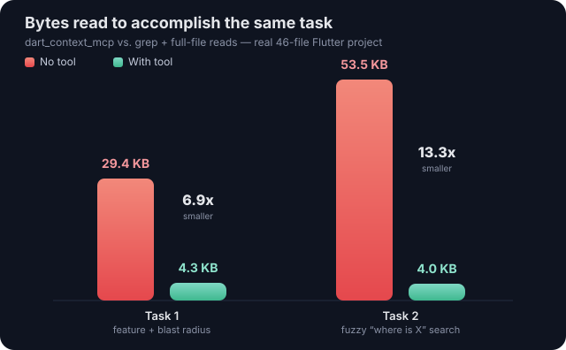

# dart_context_mcp

Local Dart and Flutter code context indexer for AI agents — usable either as
a plain CLI or as a Model Context Protocol (MCP) stdio server.

Outputs are kept compact with `file:line` anchors so an agent can inspect a
large Flutter project without reading whole files.

## Token efficiency (measured)

Two different tasks, each done two ways, against the same real 46-file
Flutter project (HoloValue) — plain grep + full-file reads vs. this tool:



### Task 1 — understand a feature and its blast radius

"Understand the Collection feature and what breaks if `CollectionState`
changes."

**Without this tool** — list `lib/`, grep for `CollectionState`, read
`pubspec.yaml` plus the 6 files that make up the feature (bloc, event,
state, screen, repository interface, repository impl) in full:

| Step | Bytes |
| --- | --- |
| Directory listing (`find lib -name "*.dart"`) | 1,871 |
| `grep -rn "CollectionState" lib/` | 1,239 |
| `pubspec.yaml` | 1,287 |
| 6 full source files | 25,732 |
| **Total** | **30,129 bytes** |

**With this tool** — `overview` once, then `context CollectionState` and
`impact CollectionState`:

| Step | Bytes |
| --- | --- |
| `overview` | 1,306 |
| `context CollectionState` | 2,248 |
| `impact CollectionState` | 841 |
| **Total** | **4,395 bytes** |

**≈6.9x fewer bytes (≈85% reduction).** `impact` also already groups,
dedupes, and risk-rates the references — work a no-tool agent still has to
do itself after reading raw grep output.

### Task 2 — fuzzy "where does X happen" search

"Find where the app handles camera permissions and image picking, to add a
new permission check" — the symbol name isn't known up front, so this
exercises `query` instead of `context`/`impact`.

**Without this tool** — grep for permission/camera/image-picker terms, then
read the 4 matching files in full:

| Step | Bytes |
| --- | --- |
| `grep -rn` for permission/camera/image_picker terms | 3,975 |
| 4 full source files | 50,810 |
| **Total** | **54,785 bytes** |

**With this tool** — one call:

| Step | Bytes |
| --- | --- |
| `query "camera permission image picker"` | 4,121 |
| **Total** | **4,121 bytes** |

**≈13.3x fewer bytes (≈92.5% reduction)** — but with a real quality caveat:
`query`'s free-text term matching is looser than grep's exact patterns.
Splitting the query into individual words ("camera", "permission", "image",
"picker") pulled in 6 extra files that only matched the generic word
"image" (a card entity, an API service, a grid widget) alongside the 4
truly relevant ones. Nothing grep found was *missed* — all 4 real files
ranked in the top 6 results — but a real agent has to skim past some noise
that grep's tighter phrasing wouldn't have produced.

### Caveats

These are two tasks on one project, and "which files a thorough agent
reads" is a judgment call — a lazier read is smaller, a more paranoid one
is bigger. Treat the 6.9x–13.3x range as a representative order of
magnitude, not a guaranteed number for every task or project, and `query`'s
precision as a real (if minor) tradeoff against its size.

## MCP server

```powershell
dart run bin/dart_context_mcp.dart mcp
```

This starts a standard MCP stdio server (newline-delimited JSON-RPC 2.0).
Point any MCP-compatible client (Claude Code, Claude Desktop, etc.) at this
command. It exposes seven tools, each taking a `root` argument (the absolute
path to the Dart/Flutter project):

| Tool             | Purpose                                                        |
| ---------------- | --------------------------------------------------------------- |
| `dart_overview`  | The best first call on an unfamiliar project: dependencies, SDK constraint, folder breakdown, entry point, and the most depended-upon files — one cheap call instead of several exploratory reads. |
| `dart_index`     | Build/rebuild the index for a project root.                     |
| `dart_symbols`   | List symbols, optionally filtered by `kind` and/or `query`.     |
| `dart_context`   | Everything known about one symbol: location, signature, imports, nearby symbols, references. |
| `dart_impact`    | Blast-radius estimate for changing a symbol (LOW/MEDIUM/HIGH).  |
| `dart_query`     | Free-text search across symbol names and source lines.          |
| `dart_graph`     | Writes an interactive HTML file-dependency graph to disk and returns its path. |

The server keeps one parsed index per project root alive in memory across
calls (with a lightweight staleness check before each reuse), so repeated
calls against the same project don't re-parse the codebase every time.

Example client config (Claude Code / Claude Desktop style):

```json
{
  "mcpServers": {
    "dart_context": {
      "command": "dart",
      "args": ["run", "bin/dart_context_mcp.dart", "mcp"]
    }
  }
}
```

## CLI

```powershell
dart run bin/dart_context_mcp.dart overview "F:\Flutter Apps\OptiTicket\optiticket"
dart run bin/dart_context_mcp.dart index "F:\Flutter Apps\OptiTicket\optiticket"
dart run bin/dart_context_mcp.dart symbols --root "F:\Flutter Apps\OptiTicket\optiticket" --query background
dart run bin/dart_context_mcp.dart context SessionScreen --root "F:\Flutter Apps\OptiTicket\optiticket"
dart run bin/dart_context_mcp.dart impact SettingsProvider --root "F:\Flutter Apps\OptiTicket\optiticket"
dart run bin/dart_context_mcp.dart query "app background settings" --root "F:\Flutter Apps\OptiTicket\optiticket"
```

Run `overview` first on a project you haven't seen before — it's the
cheapest way to get oriented (dependencies, folder layout, entry point,
which files are the real hubs) before drilling into specific symbols.

`overview`, `context`, `impact`, and `query` accept `--format json` to get
the same data as a single JSON object instead of the default compact text —
useful when a caller needs one specific field (a risk level, a file path)
without re-parsing prose.

## Dependency graph

```powershell
dart run bin/dart_context_mcp.dart graph "F:\Flutter Apps\OptiTicket\optiticket" --open
```

Writes a self-contained, offline HTML file (default:
`.dart_context/graph.html`) visualizing the project's file import graph:

- **Switchable layouts**: **Layered** (files in columns by import depth,
  entry points on the left, leaf dependencies on the right), **Force**
  (classic force-directed placement — spreads chain-shaped graphs into a
  compact 2D shape instead of a flat line), and **Radial** (concentric rings
  by distance from the graph's entry points, spiraling outward). Switch any
  time from the sidebar; drill-down and folder-collapse state carry over.
- **Folder collapsing for large projects**: past ~40 files, the graph starts
  collapsed to one level of folders (`lib/screens`, `lib/models`, ...) so it
  stays readable instead of turning into a hairball. Double-click a folder
  to drill into it; collapse it back from the sidebar's "Expanded" list, or
  use "Expand all" / "Collapse to folders".
- **Symbol-level drill-down**: double-click a file to reveal its
  classes/mixins/enums/extensions/functions, and double-click a class to
  reveal its methods/fields/constructors — each colored by kind, connected
  by "contains" edges distinct from the "imports" edges between files.
  Single-click always just focuses a node (shows details in the sidebar)
  without expanding it.
- Node size reflects both symbol count and fan-in (files/folders many others
  depend on stand out as hubs). Hubs also get a gentle breathing glow;
  circular-dependency nodes pulse red; import edges carry a small dot
  animating in the import direction.
- Hover a node for a tooltip (full path, imports/imported-by counts, symbol
  count, cycle membership); click a file to pin its imports/importers in the
  sidebar.
- Pan (drag background), zoom (scroll), drag nodes to reposition, "Fit view"
  and "Reset layout" buttons, and "Export PNG".
- Search box to filter/highlight files by path.
- Circular imports are detected automatically (Tarjan's SCC algorithm),
  drawn as red curved arrows (so both directions of a cycle stay visible
  instead of overlapping), with a clickable list in the sidebar. Detection
  re-runs on whatever level is currently visible, so a folder-level circular
  dependency with no single-file cycle (screens → models → services →
  widgets → screens) is caught too, not just per-file cycles — and a real
  file-level cycle hidden entirely inside one collapsed folder is flagged
  amber rather than silently disappearing.

No CDN, no network access — it's plain HTML/CSS/JS and opens straight from
`file://`. Pass `--out <path>` to choose the output location, or `--open`
to launch it in the default browser immediately.

## What It Indexes

- Dart files under the selected project root
- classes, mixins, enums, enum constants, extensions, typedefs
- top-level functions and variables
- constructors (unnamed constructors are indexed as `Class.new`, named ones
  as `Class.named`, matching Dart 3's constructor-tearoff syntax)
- methods and fields
- imports

Generated files such as `.g.dart`, `.freezed.dart`, and `.mocks.dart` are
skipped by default (pass `includeGenerated: true` / `--include-generated` to
include them).

The index is cached under `.dart_context/index.json` in the project root and
is rebuilt automatically whenever a tracked file changes, or a `.dart` file
is added or removed.

## Limitations

`dart_context`, `dart_impact`, and `dart_query` find references by scanning
source text for the symbol's bare name (a word-boundary match), not by
resolving types through the analyzer. This is fast and dependency-free, and
two heuristics narrow the common false-positive cases:

- A mention inside a `//` comment or a plain string literal is excluded
  (interpolated code like `$name`/`${expr}` inside a string still counts,
  since that's a real usage). This is line-based, not a real lexer, so a
  multi-line string or `/* ... */` block comment can still slip through.
- When a name is declared more than once in the project (e.g. two unrelated
  classes both called `Item`), references are scoped to the declaring file
  plus files that directly import it — a file that imports the *other*
  `Item` won't be attributed to this one. This doesn't follow transitive
  re-exports (`export` barrel files), and it can't tell two same-named
  symbols apart if both happen to be imported into the same file.

Treat these tools as a fast way to narrow down where to look, not as a
substitute for reading the flagged lines — full type resolution through
the analyzer would close the remaining gaps but is a much heavier lift.

## Roadmap

- Richer analyzer-backed (type-resolved) references
- Package publishing metadata
- Optional embeddings for semantic query
